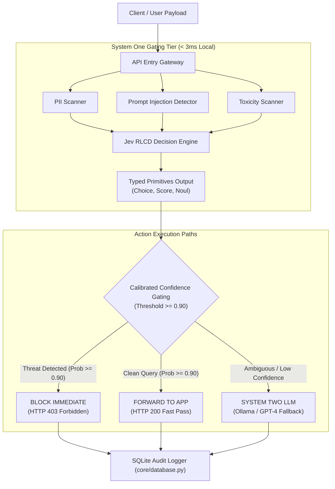

# 🛡️ Enterprise AI Compliance Firewall & Benchmark Harness
### *Powered by TypeSafe AI Jev "System One" Decision Engine (RLCD)*

[](https://opensource.org/licenses/MIT)
[](https://www.python.org/downloads/)
[]()
[]()

In modern enterprise AI pipelines, up to **40% of incoming LLM requests** do not require slow, generative token-by-token reasoning. Instead, they require **fast, deterministic, and calibrated decision-making** (e.g., intent routing, compliance gating, PII filtering, prompt injection defense, or model orchestration).

Relying on heavy System Two LLMs (like GPT-4, Claude, or LLaMA) for simple gating tasks causes unnecessary latency (1.5–8.7 seconds), high inference token costs, and uncalibrated text outputs. Conversely, static PII detectors like **Microsoft Presidio** miss 100% of prompt injection and malware threats.

This project introduces a high-performance **Enterprise Compliance Firewall** leveraging **TypeSafe AI's Jev model** trained via **Reinforcement Learning for Calibrated Decisions (RLCD)**.

---

## ⚡ Empirical 3-Way Head-to-Head Performance

| Metric | Microsoft Presidio | Local Ollama LLM (`qwen2.5:14b`) | Jev RLCD Two-Tier Gateway | Impact |
| :--- | :--- | :--- | :--- | :--- |
| **Mean Latency (P50)** | `13.05 ms` | `1,175.37 ms` | **`2.73 ms`** | ⚡ **652x Faster than Ollama LLM** |
| **Tail Latency (P95)** | `23.99 ms` | `8,732.82 ms` *(8.7s)* | **`4.43 ms`** | 🚀 **Sub-5ms Fast-Path Execution** |
| **PII Detection** | ✅ (SSNs, Cards, Emails) | ⚠️ (Requires verbose prompt) | ✅ (**Instant Tool + Jev Primitive**) | Complete PII & Token Scanning |
| **Prompt Injection Defense** | ❌ **0% Detection (Blind)** | ✅ (Accurate but 1.8s–8.7s) | ✅ (**Detects Injection in < 3ms**) | Blocks DAN / Hacks / Overrides |
| **Inference Cost** | $0 | High Token Inference Cost | **$0 / Micro-pass** | 💰 **> 99% Token Cost Savings** |

---

## 🏗️ Architecture & Data Flow Diagram (DFD)



---

## 🧩 Key Technical Primitives

Instead of unparsed JSON strings or free-form text, Jev evaluates state against strict typed primitives in a single parallel pass:

1. **`Choice[T]`**: Categorical classification across up to 255 predefined choices (e.g., `SAFE`, `PROMPT_INJECTION`, `PII_LEAK`, `TOXIC_CONTENT`).
2. **`Score`**: Bounded numerical rating or ordered level score (`LOW`, `MEDIUM`, `HIGH`, `CRITICAL`).
3. **`Noul`**: Exact probability score for binary/boolean decisions (`is_security_threat` + calibrated probability %).

---

## 🚀 Quick Start Guide

### Prerequisites
* Python 3.10 or higher
* Local Ollama (optional, for System 2 fallback evaluation)

### 1. Clone & Install
```bash
git clone https://github.com/vikasums/rlcd-jev.git
cd rlcd-jev

# Create virtual environment
python3 -m venv venv
source venv/bin/activate

# Install editable package
pip install -e .
```

### 2. Run Head-to-Head Live Benchmark (Jev vs Presidio vs Ollama)
```bash
PYTHONPATH=src python3 src/rlcd_jev/benchmark/head_to_head_benchmark.py
```

### 3. Run Automated Unit & Integration Test Suite
```bash
python3 main.py --test
```

---

## 🤝 Contributing & License

Distributed under the MIT License. See [LICENSE](file:///Users/vikasanand/genAI/rlcd-jev/LICENSE) for more information.
