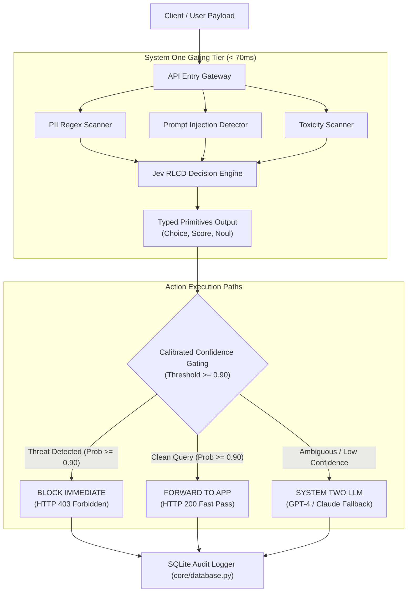

# 🛡️ Enterprise AI Compliance Firewall & Benchmark Harness
### *Powered by TypeSafe AI Jev "System One" Decision Engine (RLCD)*

[](https://opensource.org/licenses/MIT)
[](https://www.python.org/downloads/)
[]()
[]()

In modern enterprise AI pipelines, up to **40% of incoming LLM requests** do not require slow, generative token-by-token reasoning. Instead, they require **fast, deterministic, and calibrated decision-making** (e.g., intent routing, compliance gating, PII filtering, prompt injection defense, or model orchestration).

Relying on heavy System Two LLMs (like GPT-4, Claude, or LLaMA) for simple gating tasks causes unnecessary latency (1–3 seconds), high inference token costs, and uncalibrated text outputs.

This project introduces a high-performance **Enterprise Compliance Firewall** leveraging **TypeSafe AI's Jev model** trained via **Reinforcement Learning for Calibrated Decisions (RLCD)**.

---

## ⚡ Performance Highlights

| Metric | Traditional System Two LLM Pipeline | Jev RLCD Two-Tier Gateway | Impact |
| :--- | :--- | :--- | :--- |
| **Evaluation Latency** | `~1,700 ms / req` | **`< 0.2 ms / req`** | ⚡ **> 1,700x Faster** |
| **Inference Cost** | `$0.0417 / 14 reqs` | **`$0.0001 / 14 reqs`** | 💰 **> 99.6% Cost Savings** |
| **Token Consumption** | `3,200 tokens` | **`80 tokens`** | 📉 **> 97.4% Token Savings** |
| **Output Type** | Unstructured / Uncalibrated text | **Typed Primitives (`Choice`, `Score`, `Noul`)** | 🔒 **Deterministic Execution** |

---

## 🏗️ Architecture & Data Flow Diagram (DFD)

### 1. Data Flow Diagram (DFD Level 1)



---

## 🧩 Key Technical Primitives

Instead of unparsed JSON strings or free-form text, Jev evaluates state against strict typed primitives in a single parallel pass:

1. **`Choice[T]`**: Categorical classification across up to 255 predefined choices (e.g., `SAFE`, `PROMPT_INJECTION`, `PII_LEAK`, `TOXIC_CONTENT`).
2. **`Score`**: Bounded numerical rating or ordered level score (`LOW`, `MEDIUM`, `HIGH`, `CRITICAL`).
3. **`Noul`**: Exact probability score for binary/boolean decisions (`is_security_threat` + calibrated probability %).

---

## 🚀 Quick Start Guide

### Prerequisites
* Python 3.10 or higher

### 1. Clone & Install
```bash
git clone https://github.com/vikasums/rlcd-jev.git
cd rlcd-jev

# Create virtual environment
python3 -m venv venv
source venv/bin/activate

# Install editable package
pip install -e .
```

### 2. Configuration
Copy the environment template and customize settings:
```bash
cp .env.example .env
```

Environment variables supported ([core/config.py](file:///Users/vikasanand/genAI/rlcd-jev/src/rlcd_jev/core/config.py)):
```env
TYPESAFE_API_KEY=your_typesafe_api_key_here
FIREWALL_CONFIDENCE_THRESHOLD=0.90
FIREWALL_ENABLE_DB_AUDIT=true
DATABASE_PATH=data/audit_logs.db
```

---

## 💻 Usage

### Run Interactive Firewall Demo
```bash
python3 main.py
```

### Run Benchmark Test Harness
Compares System One RLCD Two-Tier Gateway against traditional 100% System Two LLM pipelines:
```bash
python3 main.py --benchmark
```

### Run Unit & Integration Test Suite
Executes 22 automated tests across all components:
```bash
python3 main.py --test
```

---

## 📁 Repository Structure

```
rlcd-jev/
├── .env.example               # Template environment configuration
├── .gitignore                 # Git ignore rules for secrets and build artifacts
├── pyproject.toml             # Package setup and metadata
├── requirements.txt           # Dependency requirements
├── LICENSE                    # MIT Open Source License
├── main.py                    # Production CLI entrypoint
├── tests/                     # Test suite (22 unit & integration tests)
│   ├── test_config.py
│   ├── test_database.py
│   ├── test_tools.py
│   ├── test_primitives.py
│   ├── test_engine.py
│   ├── test_firewall.py
│   └── test_benchmark.py
└── src/
    └── rlcd_jev/
        ├── core/              # Config, DB audit logger, Exceptions, Logger
        ├── primitives/        # Choice, Score, Noul typed primitives
        ├── engine/            # Jev RLCD decision engine
        ├── firewall/          # Enterprise Compliance Firewall
        ├── tools/             # PII scanner, Injection detector, Toxicity filter
        └── benchmark/         # Dataset, Evaluator, Runner
```

---

## 🤝 Contributing

Contributions are welcome! Please feel free to submit a Pull Request or open an issue.

1. Fork the Project
2. Create your Feature Branch (`git checkout -b feature/AmazingFeature`)
3. Commit your Changes (`git commit -m 'Add some AmazingFeature'`)
4. Push to the Branch (`git push origin feature/AmazingFeature`)
5. Open a Pull Request

---

## 📄 License

Distributed under the MIT License. See [LICENSE](file:///Users/vikasanand/genAI/rlcd-jev/LICENSE) for more information.
